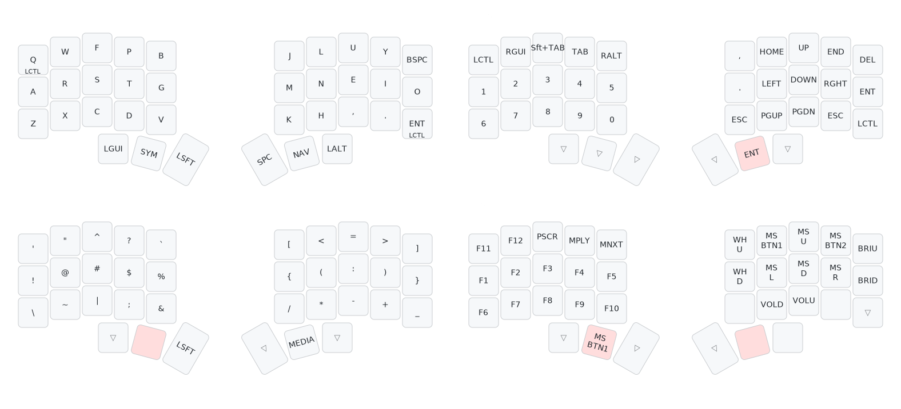

<h1 align='center'>Maron's QMK keymaps</h1>

<p align='center'>
My personal keymaps for mechanical keyboards via <a href='https://qmk.fm/'>QMK firmware</a>.



## Less is more

> “In my experience, the key to sustained success with this philosophy is accepting that it’s not really about technology, but is instead more about the quality of your life.”
>
> -- <cite>Digital Minimalism By Cal Newport (pg 253)</cite>

- **Minimal strains.** Colemak Mod-DH puts wrists in ergonomic position for typing comfort to reduce RSIs. 
- **Minimal movements.** 30% layout split into 5 columns each keeps hands in steady position and fingers one key distance from the home row.
- **Minimal tap-holds.** Dedicated thumb keys for activating layers instead of utilizing [home row mods](https://precondition.github.io/home-row-mods) for improved precision and rhythm.
- **Minimal shift-dances.** Programming made easier with symbols clustered together within a single layer with pairs positioned laterally.

## Install

```bash
git clone git@github.com:maronavenue/qmk_keymaps.git
qmk compile -kb crkbd/rev1 -km crkbd_chocofi_helios -e CONVERT_TO=helios
```

> [!IMPORTANT]  
>  Make sure to compile into a target that is compatible to your MCU. This is currently based on the RP2040 SuperMini, hence the conversion to Helios (`.uf2`). See https://docs.qmk.fm/feature_converters for more details.

## Notes

- Configured handedness via `#define` because getting the left and right bootloader to EEPROM with a suitable UF2 conversion proved to be a struggle (See https://docs.qmk.fm/features/split_keyboard#handedness-by-define).
- :construction: LED work
- :construction: Optimization for Vim motions

## Credits

- [Next Keyboard Club](https://nextkeyboard.club/) ([@nextkeyboard.club](https://www.instagram.com/nextkeyboard.club/)) for inspiring me to seriously go down the ergonomic path
- [@rstacruz](https://github.com/rstacruz/my_qmk_keymaps) for sharing the legendary keymap where this is absolutely based off of for his OLKB planck keyboard (couldn't agree more with the philosophy)
- [@kohane27](https://github.com/kohane27) for blessing us with [The Definitive Guide To qmk Compiling And Flashing chocofi With Sea Picro (rp2040)](https://devctrl.blog/posts/the-definitive-guide-to-qmk-compiling-and-flashing-chocofi-with-sea-picro-rp2040/)